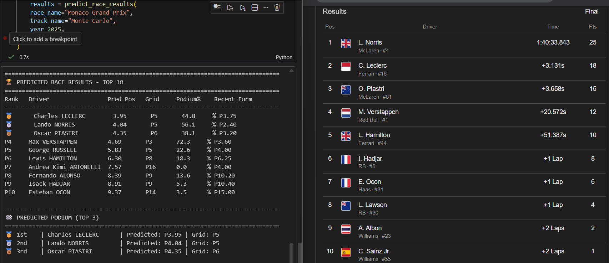
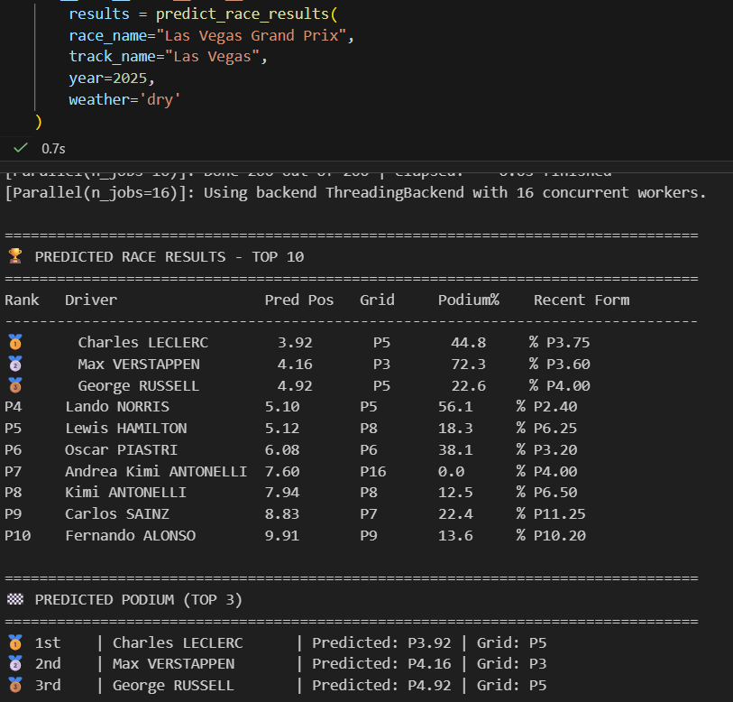

# 🏎️ Formula 1 Race Prediction Model

A machine learning model using **Random Forest Regressor** to predict Formula 1 race results and podium finishers. The model analyzes historical F1 data from 2023-2025 seasons and achieves **~70% accuracy (R² = 0.70)** on test data (will be improving with future data).


## 🎯 Project Overview

This project predicts:
- **Top 3 podium finishers** for any F1 race
- **Finishing positions** for all drivers
- **Race outcomes** for past races (validation) and future races (prediction)

### Key Features

- 32 engineered features including driver performance, track history, and recent form
- Random Forest Regressor with 200 trees and optimized hyperparameters
- 70% variance explained (R² = 0.70) on unseen data
- ±2 position accuracy (MAE = 2.01) on test set
- Flexible predictions with or without qualifying data

---

## 📊 Model Performance

### Training Set
- **Root Mean Squared Error (RMSE):** 1.498 positions
- **Mean Absolute Error (MAE):** 1.087 positions
- **R² Score:** 0.918

### Test Set
- **Root Mean Squared Error (RMSE):** 2.889 positions
- **Mean Absolute Error (MAE):** 2.011 positions
- **R² Score:** 0.700

**Interpretation:** The model predicts finishing positions with an average error of ±2 positions, excellent for F1 race prediction.

---

## 🗂️ Project Structure

├── f1_race_data_2023.csv # F1 race data for 2023 season
├── f1_race_data_2024.csv # F1 race data for 2024 season
├── f1_race_data_2025.csv # F1 race data for 2025 season
├── f1_data.csv # Merged dataset
├── model.ipynb # Data loading, feature engineering, training
├── test.ipynb # Predictions for any race
├── f1_random_forest_model.pkl # Trained Random Forest model
├── label_encoders.pkl # Saved label encoders
├── feature_columns.pkl # List of features used
└── README.md # This file


---

## 🚀 Quick Start

### Prerequisites

- Python 3.8+
- pandas
- numpy
- scikit-learn
- matplotlib


### Installation

1. Clone the repository
2. git clone https://github.com/yourusername/f1-race-prediction.git
3. cd f1-race-prediction
4. Run model training (optional)
jupyter notebook model.ipynb
5. Make predictions
jupyter notebook test.ipynb


---

## 📖 Usage

### Train the Model (model.ipynb)

- Data loading and merging (2023-2025 seasons)
- Feature engineering (32 features)
- Model training with Random Forest Regressor
- Model evaluation and performance metrics
- Saves trained model and encoders

### Predict Race Results (test.ipynb)

**Ex: Predict Las Vegas GP 2025**

```
#Without Qualifying(GRID POS) data
results = predict_race_results(
race_name="Las Vegas Grand Prix",
track_name="Las Vegas",
year=2025,
weather='dry',
grid_positions=None
)

#With Qualifying Data
quali = {
'Max VERSTAPPEN': 1,
'Lando NORRIS': 2,
'Charles LECLERC': 3,
'Carlos SAINZ': 4,
'Oscar PIASTRI': 5,
# ... add all drivers
}

results = predict_race_results(
race_name="Las Vegas Grand Prix",
track_name="Las Vegas",
year=2025,
weather='dry',
grid_positions=quali
)
```


---

## 🎯 Features Used

The model uses **32 features** across 7 categories:

| Category | Features | Description |
|----------|----------|-------------|
| Starting Position | grid_position | Qualifying position |
| Driver Performance | avg_finish, finish_std, race_count, avg_grid | Historical averages |
| Success Rates | podium_rate, win_rate, dnf_rate | Success percentages |
| Track-Specific | track_avg_finish, track_podium_rate | Circuit performance |
| Recent Form | recent_form_5, recent_form_3, recent_podiums_5 | Last 5 and 3 races |
| Encoded Categories | track_encoded, driver_encoded, weather_encoded | Categorical features |
| Interaction Features | grid_advantage, consistency_score | Engineered combinations |

---

## 📈 Example Output
### 🏁 PREDICTED RACE RESULTS - TOP 10



---


---

## 🔧 Model Details

### Algorithm
**Random Forest Regressor**

Hyperparameters:
- n_estimators: 200 trees
- max_depth: 15
- min_samples_split: 5
- min_samples_leaf: 2
- max_features: sqrt
- random_state: 42

### Why Random Forest?

- Handles non-linear relationships
- Robust to outliers
- Provides feature importance
- Good performance without extensive tuning
- Works with mixed feature types

---

## 📊 Dataset

F1 race data columns:

- grandprix - Grand Prix name
- year - Season year (2023-2025)
- driver_name - Driver full name
- track - Circuit name
- track_type - Circuit or street
- wet_dry - Weather condition
- fastest_lap_time - Fastest lap
- pitstops - Number of pit stops
- grid_position - Starting position
- finished_position - Final race position

---


## 🛠️ Future Improvements

- Add tire strategy and compound data
- Include live race data (lap-by-lap)
- Implement XGBoost for comparison
- Weather forecast integration
- Web dashboard for predictions
- Constructor/team performance features
- Hyperparameter tuning with GridSearchCV
- DNF prediction classifier

---

## 📝 Notes

### Why Decimal Predictions?

Random Forest Regressor predicts continuous values (P3.92) because:
- Averages predictions from 200 trees
- More nuanced predictions
- Can be rounded to nearest integer

### Grid Position Handling

**Without qualifying data:**
- Uses historical average grid positions
- Accuracy decreases by ~10-15%
- Useful for early predictions

**With qualifying data:**
- Uses actual starting positions
- Significantly more accurate
- Recommended for race day

---


Made with ❤️ for Formula 1 fans and data science enthusiasts


